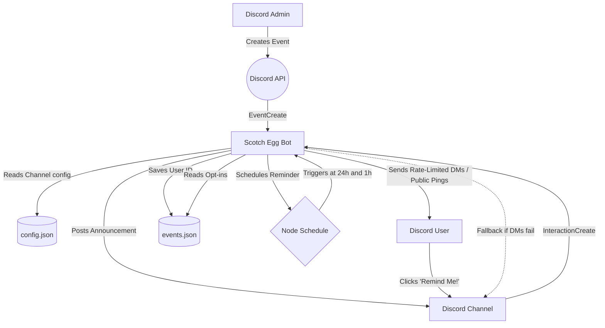

# Scotch Egg Bot - Discord Event Reminder Bot

A completely free Discord bot that hooks seamlessly into native Discord events. No clunky special event commands. End `@everyone` spam and send automated event reminders only to the users who actually want them. Optimized for Raspberry Pi.

## Features

- **Native Discord Events:** Automatically posts an embedded announcement to a designated channel when a new Guild Scheduled Event is created. No need to learn complicated `!create` commands.
- **Strictly Opt-In Reminders:** Built on a core philosophy of user consent. Instead of annoying mass `@everyone` pings, users explicitly choose which events they want to be notified about. Keep your community in the loop exactly how you prefer via Private DMs or Public Mentions.
- **Automated Alerts:** Sends out reminders at customizable intervals (defaults to 24 hours and 1 hour) before an event's start time.
- **Auto-Cleanup / Auto-Archive:** Automatically grays out and archives (or optionally deletes entirely) old announcements when events conclude.
- **Add to Calendar Button:** Event announcements include a convenient link button to add the event directly to the user's Google Calendar.
  - Alerts use a clean, text-based format (including event name, description, location, and dynamic Discord timestamps) to avoid cluttered double-embeds.
- **Auto-Create Discussion Threads:** The bot automatically creates a dedicated discussion thread on new event announcements to encourage community engagement.
- **Dynamic Relative Timestamps:** Event dates display a relative countdown alongside the date and time (e.g., *Tuesday, October 24, 2023 8:00 PM (in 3 days)*) when the event is less than a week away.
- **Graceful Fallback:** In Private Mode, if no users opt-in or if the bot cannot DM users, it falls back to posting the reminder in the public announcement channel so the alert is not lost.
- **SD-Card Friendly:** Specifically designed to run on a Raspberry Pi without wearing out the SD card. It uses a lightweight `events.json` file to store opted-in users, mapping them safely with minimal disk writes.
- **Dynamic Updates:** Automatically resyncs reminders if an event's start time is updated, and cleans up scheduled jobs/data if an event is deleted.

## Example Reminder Message
**Public Reminder (24-Hour Alert)**  
> 📢 24h until **Sunday Brunch at Eggcellent Café**!
> 🗓️ Sunday, May 31, 2026 11:00 AM (in 1 day)
> 📍 Eggcellent Café
> 
> Let's get together and enjoy the finest egg dishes, pancakes, and bottomless mimosas at the fictional Eggcellent Café! Don't miss out on their famous Antigravity soufflé pancake.
> 
> @User1 @User2 @User3
> 
> `[ ⏰ Remind Me! ]` `[ 📅 Add to Calendar ]` *(Interactive Buttons)*

## Prerequisites & Discord Setup

1. Go to the [Discord Developer Portal](https://discord.com/developers/applications) and click **New Application**.
2. On the "General Information" page, copy your **Application ID** (this will be your `CLIENT_ID`).
3. Navigate to the "Bot" tab on the left, click **Reset Token**, and copy the new token (this will be your `DISCORD_TOKEN`).
4. Go to "OAuth2" > "OAuth2 URL Generator". Check the `bot` and `applications.commands` scopes. Copy the generated URL at the bottom and open it in your browser to invite the bot to your server.
5. Ensure you have **Node.js (v16.14.0 or higher)** installed, OR **Docker** if you prefer containerized deployment.

*Note: **No Privileged Intents are required!** The bot relies entirely on modern slash commands.*

## Configuration

**Environment Variables:**
   Create a `.env` file in the root directory and configure your bot token and Client ID. The `ANNOUNCEMENT_CHANNEL_ID` is now optional and acts as a fallback if the `/setchannel` command has not been used in a server.
   ```env
   DISCORD_TOKEN=your_actual_token_here
   CLIENT_ID=your_bot_client_id_here
   ADMIN_USER_ID=your_discord_user_id_here # Optional: Receives DM on errors
   ANNOUNCEMENT_CHANNEL_ID=your_optional_fallback_channel_id_here
   ```

## Slash Command Setup

This bot uses slash commands for configuration. Before running the bot for the first time, you must register its commands with Discord.

1.  Make sure your `.env` file is configured with your `DISCORD_TOKEN` and `CLIENT_ID`.
2.  Run the deployment script:
    ```bash
    node deploy-commands.js
    ```
    You only need to do this once, or whenever you add/change a command.

## Local Installation

1. Install dependencies:
   ```bash
   npm install
   ```
2. Start the bot:
   ```bash
   node index.js
   ```

## Docker Deployment (CLI)

This bot is designed to be easily containerized and run quietly in the background on devices like a Raspberry Pi.

1. **Build the image:**
   ```bash
   docker build -t scotch-egg-bot .
   ```

2. **Run the container:**
   ```bash
   docker run -d --name scotch-egg-bot --env-file .env scotch-egg-bot
   ```

## Docker Compose Deployment (Recommended)

Using Docker Compose makes it much easier to manage the container and perfectly map the `events.json` file so that your reminder database survives container restarts.

1. **Create an empty database file first:**
   Before starting the container, you *must* create empty database and config files on your host machine. If you skip this, Docker will mistakenly create directories instead of files.
   ```bash
   echo "{}" > events.json
   echo "{}" > config.json
   ```

2. **Start the bot:**
   Run the following command in the same directory as your `compose.yaml` (or `docker-compose.yml`):
   ```bash
   docker compose up -d --build
   ```
   The bot will now run in the background, and any events or users who opt-in will be saved securely to the physical `events.json` file right next to your code.

## Commands Reference

### Administrator Commands

*   `/settings channel [channel]`
    -   **Action:** Sets the specific channel where the bot will post new event announcements and reminders for the current server.

*   `/settings mode [mode]`
    -   **Action:** Toggles whether the 24h and 1h event reminders are posted publicly in the configured channel (tagging opted-in users) or DMed privately.

*   `/settings view`
    -   **Action:** Displays the currently configured channel and reminder mode for this server.

*   `/settings calendar [enabled]`
    -   **Action:** Toggles whether the bot includes an "Add to Calendar" button on event announcements.

*   `/settings threads [enabled]`
    -   **Action:** Toggles whether the bot automatically creates a dedicated discussion thread on new announcements.

*   `/settings autodelete [enabled]`
    -   **Action:** Toggles whether event announcements are completely deleted from the channel when the event ends, rather than just being gracefully archived.

*   `/settings intervals [times]`
    -   **Action:** Sets custom reminder intervals using a comma-separated list (e.g., `24h, 1h, 15m`). Up to 5 intervals can be set per server.

*   `/settings testreminder`
    -   **Action:** Displays a mock preview of what a reminder message will look like with the server's current settings.

*   `/announceevent [event_link_or_id]`
    -   **Action:** Manually posts an announcement for an existing event. The bot proactively verifies channel permissions before posting. This is useful if the bot was offline when the event was created.

*   `/stats`
    -   **Action:** View opt-in statistics for upcoming events in this server.

### Public Commands

*   `/upcoming`
    -   **Action:** View a paginated list of upcoming events in this server and easily opt-in to reminders for them.

*   `/myreminders`
    -   **Action:** Lists all upcoming events you are currently receiving reminders for in this server.

*   `/help`
    -   **Action:** Displays information on how to use the bot and a list of available commands.

## How It Works (Storage Architecture)
To minimize disk wear on single-board computers (like the Raspberry Pi):

- When an announcement is posted, it creates a record for that event in a local `events.json` file.
- When a user clicks the "Remind Me!" button, their Discord User ID is added to (or removed from) an object of opted-in users associated with that event's record. This object-based storage is highly efficient for lookups.
- When it is time to send a reminder, the bot reads the opted-in users directly from the database and either DMs them or pings them publicly in the channel, depending on the server's configured mode.
- The database is automatically pruned when events are deleted, canceled, or completed to keep it lightweight.

### Architecture Diagram



## Dependencies

- [discord.js](https://discord.js.org/) - The primary library for interacting with the Discord API.
- [node-schedule](https://github.com/node-schedule/node-schedule) - Used for scheduling the precise 24h and 1h alert triggers.
- [dotenv](https://github.com/motdotla/dotenv) - For loading the bot token from the `.env` file.

## FAQ

**Q: Does the bot support multiple servers (Guilds)?**
A: Yes! You can invite the bot to as many servers as you want. Just use `/settings channel` in each server to configure where announcements should be posted. The bot keeps all reminders and configurations perfectly separated.

**Q: What happens if the bot goes offline while an event is created or deleted?**
A: Don't worry! Every time the bot starts up, it performs "Offline Garbage Collection." It automatically syncs with Discord, schedules reminders for any new events it missed, and deletes data for events that were canceled while it was down.

**Q: Why do I need to create empty `events.json` and `config.json` files for Docker?**
A: Docker Compose maps these files from your host to the container. If the files don't exist on your host machine *before* you run `docker compose up`, Docker assumes you are trying to map directories and will create folders named `events.json` and `config.json`. This will crash the bot.

**Q: Why are the DM reminders plain text instead of Rich Embeds?**
A: This is intentional. When an event URL is sent in a DM, Discord automatically generates a Rich Embed preview for it. If the bot sent an Embed, it would result in a cluttered "double-embed" in the user's DM.

**Q: Can users opt out of reminders?**
A: Yes! Users can either click the "Remind Me!" button on the announcement again, click the "Cancel Reminders" button at the bottom of a DM reminder, or use the `/myreminders` command to see a list of their events and opt out from there.